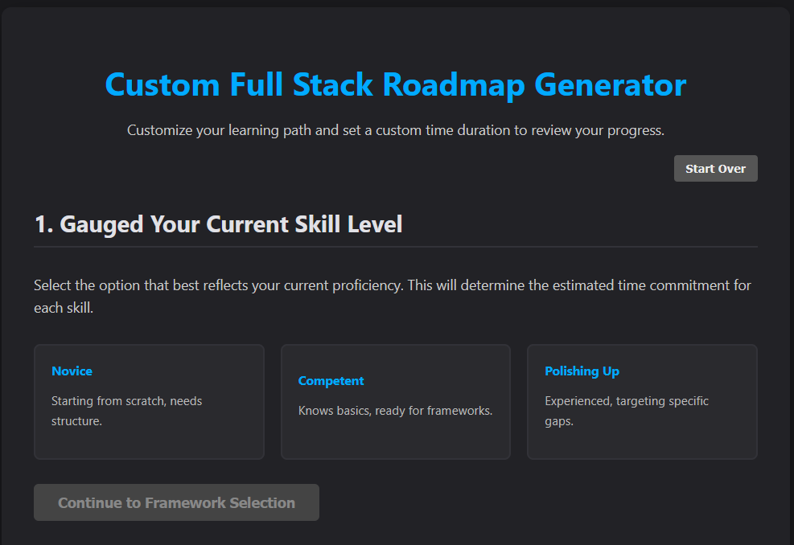

# 🚀 Custom Full Stack Roadmap Generator

This is a dynamic React + TypeScript application designed to help aspiring and current developers build a personalized learning roadmap. Users answer a series of questions about their expertise level and technology preferences, and the app generates a complete, step-by-step learning path with estimated time commitments.

## Cover



## ✨ Features

-  **Personalized Wizard:** A multi-step questionnaire guides users through selecting their expertise, frontend framework, backend framework, and database.
-  **Dynamic Time Calculation:** Estimates total learning time in hours, based on a "Core Competency Hours" (CCH) value for each skill, multiplied by the user's expertise level.
-  **Expertise-Based Filtering:** Intelligently hides or shows advanced options (like Kubernetes or "Enterprise Grade" tools) based on whether the user selects "Novice," "Competent," or "Polishing Up."
-  **Intelligent Recommendations:** Provides helpful "wise notes" and highlights recommended choices (e.g., suggesting Nest.js for a React frontend).
-  **Session Persistence:** Automatically saves your progress to `localStorage`, so you can close the tab and return without starting over.
-  **Structured Results:** Displays a final "Golden Path" of your chosen skills alongside a clear "Alternatives & Next Steps" view, all organized by category.

## 🛠️ Tech Stack

-  **React**
-  **TypeScript**
-  **Vite** (assumed, adjust if using CRA)
-  **CSS Modules / CSS Variables** for styling
-  **LocalStorage** for session management

## 🚀 Getting Started

To run this project locally, follow these steps:

1. **Clone the repository:**

   ```sh
   git clone [https://github.com/your-username/your-repo-name.git](https://github.com/your-username/your-repo-name.git)
   cd your-repo-name
   ```

2. **Install dependencies:**

   ```sh
   npm install
   ```

3. **Run the development server:**

   ```sh
   npm run dev
   ```

   (If you are using Create React App, you may need to use `npm start`)

4. Open [http://localhost:5173](http://localhost:5173) (or the port shown) in your browser.

## 🧠 How It Works

The app's logic is powered by a central `data.ts` file, which acts as a "single source of truth" for all skills, categories, and logic.

-  **Data Structure:** The data is organized in a 3-level hierarchy: `TopLevelDomain` > `SkillCategory` > `SkillOption`.
-  **Filtering:** Each `SkillOption` has a `level` property (`Must Have`, `Intermediate`, `Professional`). The user's initial choice (e.g., "Novice") sets a filter that hides any skills above their level.
-  **Time Calculation:** Each `SkillOption` has a `cch` (Core Competency Hours) value. The `LEVEL_MULTIPLIERS` object in `data.ts` uses the user's level to calculate the final estimated time (`cch * multiplier`).
-  **State Management:** The main `App.tsx` component acts as a "wizard controller," holding all user choices in a single `roadmapState` object and rendering the correct component (e.g., `FrameworkSelector`, `BackendSelector`) for the current `step`.

## 🤝 How to Contribute

Contributions are welcome! If you have ideas for new features, new skills to add, or improvements:

1. Fork the Project
2. Create your Feature Branch (`git checkout -b feature/AmazingFeature`)
3. Commit your Changes (`git commit -m 'Add some AmazingFeature'`)
4. Push to the Branch (`git push origin feature/AmazingFeature`)
5. Open a Pull Request

## 📝 License

This project is licensed under the MIT License. See the `LICENSE` file for details.
